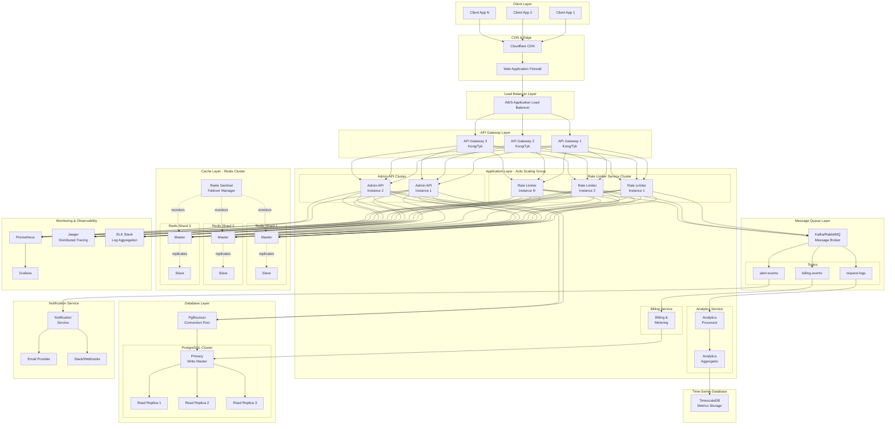

# Rate Limiter System Architecture

## High-Traffic Production Architecture

This document describes a scalable, production-ready architecture for the rate limiter system designed to handle high traffic volumes and support a profitable SaaS business model.

## System Architecture Diagram



## Component Details

### 1. Client Layer
**Purpose**: Applications consuming the rate limiting service

**Components**:
- Customer applications making API calls
- Various client types (web, mobile, server-to-server)

**Characteristics**:
- Distributed globally
- Various traffic patterns
- Different SLA requirements based on subscription tier

---

### 2. CDN & Edge Layer
**Purpose**: DDoS protection, SSL termination, global distribution

**Components**:
- **Cloudflare CDN**: 
  - Global edge locations
  - DDoS mitigation
  - SSL/TLS termination
  - Basic rate limiting at edge
  
- **Web Application Firewall (WAF)**:
  - SQL injection protection
  - XSS attack prevention
  - Bot detection
  - Geographic filtering

**Benefits**:
- Reduces load on origin servers
- Improves global latency
- First line of defense against attacks
- Can handle 10M+ requests/second at edge

---

### 3. Load Balancer Layer
**Purpose**: Distribute traffic across API gateways

**Components**:
- **AWS Application Load Balancer** (or equivalent):
  - Health checks
  - SSL termination (if not done at CDN)
  - Path-based routing
  - WebSocket support

**Configuration**:
- Round-robin or least-connections algorithm
- Sticky sessions for admin dashboard
- Automatic scaling integration

---

### 4. API Gateway Layer
**Purpose**: Request routing, authentication, basic rate limiting, protocol translation

**Components**:
- **Kong or Tyk API Gateway** (3+ instances):
  - Request routing
  - API key validation
  - Request/response transformation
  - Circuit breaker pattern
  - Request queuing during spikes
  - Metrics collection

**Responsibilities**:
- Validate API keys
- Apply basic DoS protection
- Route to appropriate service
- Implement retry logic
- Aggregate responses

**Scaling**:
- Horizontal scaling: 3-50 instances
- Auto-scaling based on request rate
- Multi-AZ deployment for high availability

---

### 5. Application Layer

#### 5.1 Rate Limiter Service (Core Service)
**Purpose**: Primary rate limiting logic

**Instances**: 10-100+ instances (auto-scaled)

**Responsibilities**:
- Check rate limits against Redis
- Apply sliding window algorithm
- Publish request events to message queue
- Return 200 (allowed) or 429 (rate limited)

**API Endpoints**:
- `POST /check` - Check rate limit for a request

**Performance Target**:
- < 5ms p99 latency
- 50,000+ requests/second per instance
- Stateless design for easy scaling

**Communication**:
- **Inbound**: HTTP/REST from API Gateway
- **Outbound**: 
  - Redis for rate limit checks (TCP)
  - Message Queue for events (AMQP/Kafka protocol)
  - No direct database access

**Scaling Strategy**:
- CPU-based auto-scaling (target: 70% utilization)
- Request rate-based scaling
- Predictive scaling for known traffic patterns

---

#### 5.2 Admin API Service
**Purpose**: Configuration management and dashboard backend

**Instances**: 2-10 instances

**Responsibilities**:
- Tenant CRUD operations
- Rate limit configuration
- Analytics queries
- Dashboard API endpoints

**API Endpoints**:
- `/tenants/*` - Tenant management
- `/rate-limits/*` - Rate limit configuration
- `/analytics/*` - Metrics and reports
- `/billing/*` - Usage and billing data

**Communication**:
- **Inbound**: HTTP/REST from API Gateway
- **Outbound**:
  - PostgreSQL (via connection pool)
  - Redis (for cache invalidation)
  - Message Queue (for audit logs)

**Security**:
- JWT-based authentication
- Role-based access control (RBAC)
- API rate limiting (separate from customer limits)

---

#### 5.3 Analytics Service
**Purpose**: Process request logs and generate insights

**Components**:
- **Analytics Processor**: Real-time stream processing
- **Analytics Aggregator**: Batch aggregation and reporting

**Responsibilities**:
- Consume request logs from message queue
- Calculate metrics (requests/sec, block rate, etc.)
- Generate time-series data
- Aggregate data for dashboards

**Data Flow**:
1. Consume from `request-logs` topic
2. Process and enrich data
3. Write to TimescaleDB
4. Update real-time dashboards

**Scaling**:
- Consumer groups for parallel processing
- Partitioned by tenant ID
- Can process 100K+ events/second

---

#### 5.4 Billing Service
**Purpose**: Track usage and calculate charges

**Responsibilities**:
- Count requests per tenant
- Track usage against quotas
- Generate billing events
- Calculate overages
- Integration with payment providers (Stripe)

**Data Flow**:
1. Consume from `billing-events` topic
2. Aggregate usage by tenant/period
3. Compare against plan limits
4. Generate invoices
5. Trigger notifications for quota warnings

**Metering Strategy**:
- Real-time usage tracking
- Daily aggregation for accuracy
- Monthly billing cycles
- Overage calculation and alerts

---

### 6. Message Queue Layer
**Purpose**: Asynchronous event processing and service decoupling

**Technology**: Kafka or RabbitMQ

**Topics**:
1. **request-logs**: All rate limit check events
   - Partitioned by tenant ID
   - Retention: 7 days
   - Consumers: Analytics Service, Billing Service

2. **billing-events**: Usage and metering data
   - Partitioned by tenant ID
   - Retention: 30 days
   - Consumers: Billing Service

3. **alert-events**: System alerts and notifications
   - Partitioned by severity
   - Retention: 3 days
   - Consumers: Notification Service

**Benefits**:
- Decouples services
- Handles traffic spikes
- Guaranteed delivery
- Replay capability for debugging

**Scaling**:
- Partitioning for parallelism
- Consumer groups for load distribution
- Cross-region replication for DR

---

### 7. Cache Layer - Redis Cluster
**Purpose**: Distributed rate limit counters and configuration cache

**Architecture**:
- **3+ Shards** (Master-Slave pairs)
- **Redis Sentinel** for automatic failover
- Consistent hashing for key distribution

**Data Stored**:
1. **Rate Limit Counters**:
   - Key: `ratelimit:{tenant}:{type}:{identifier}`
   - Type: Sorted Set (score = timestamp)
   - TTL: Window duration + buffer

2. **Tenant Configuration Cache**:
   - Key: `tenant:config:{tenantId}`
   - Type: Hash
   - TTL: 5 minutes

3. **API Key Lookup**:
   - Key: `apikey:{key}`
   - Type: String (tenant ID)
   - TTL: 10 minutes

**Performance**:
- < 1ms latency for operations
- 100K+ operations/second per shard
- Automatic sharding for horizontal scaling

**High Availability**:
- Master-Slave replication
- Sentinel for automatic failover
- < 30 second failover time

---

### 8. Database Layer - PostgreSQL

**Architecture**:
- **1 Primary** (write operations)
- **3+ Read Replicas** (read operations)
- **PgBouncer** connection pooling

**Schema**:
- **tenants**: Tenant information and configuration
- **rate_limits**: Rate limit rules
- **subscriptions**: Plan and billing information
- **api_keys**: API key management
- **audit_logs**: System audit trail

**Usage Pattern**:
- Admin API writes to Primary
- Dashboard queries from Read Replicas
- Reports and analytics from Read Replicas
- Bulk operations use dedicated replica

**Optimization**:
- Partitioning by tenant_id for large tables
- Indexes on frequently queried fields
- Materialized views for complex aggregations
- Regular VACUUM and ANALYZE

**Backup Strategy**:
- Continuous archiving (WAL)
- Daily full backups
- Point-in-time recovery (PITR)
- Cross-region backup replication

---

### 9. Time-Series Database - TimescaleDB
**Purpose**: Store and query time-series metrics

**Data Stored**:
- Request counts per minute/hour/day
- Block rates over time
- Latency percentiles (p50, p95, p99)
- Resource utilization metrics

**Queries**:
- Dashboard real-time metrics
- Historical trend analysis
- Capacity planning reports
- Customer usage reports

**Retention**:
- Raw data: 30 days
- 1-hour aggregates: 1 year
- Daily aggregates: 5 years

---

### 10. Monitoring & Observability

#### Prometheus + Grafana
**Purpose**: Metrics collection and visualization

**Metrics Collected**:
- Request rate (per service, per tenant)
- Error rates and types
- Latency percentiles
- Cache hit ratios
- Database query performance
- Queue depths

**Dashboards**:
- System health overview
- Service-specific metrics
- Tenant usage dashboards
- Cost and billing metrics

#### Jaeger - Distributed Tracing
**Purpose**: End-to-end request tracing

**Capabilities**:
- Trace requests across services
- Identify bottlenecks
- Debug performance issues
- Understand service dependencies

#### ELK Stack - Logging
**Purpose**: Centralized log aggregation

**Components**:
- **Elasticsearch**: Log storage and search
- **Logstash**: Log processing pipeline
- **Kibana**: Log visualization and search UI

**Log Types**:
- Application logs (INFO, ERROR, DEBUG)
- Access logs
- Audit logs
- Security events

---

### 11. Notification Service
**Purpose**: Alert delivery and customer communications

**Responsibilities**:
- Rate limit violation alerts
- Quota warnings (80%, 90%, 100%)
- System incident notifications
- Billing notifications
- Service degradation alerts

**Channels**:
- Email (via SendGrid/SES)
- Slack webhooks
- SMS (via Twilio)
- Custom webhooks

**Event Types**:
- **QUOTA_WARNING**: Customer approaching limit
- **QUOTA_EXCEEDED**: Customer exceeded limit
- **SYSTEM_ALERT**: Infrastructure issues
- **BILLING_EVENT**: Payment issues or renewals

---

## Traffic Flow Examples

### 1. Rate Limit Check Flow
```
Client → CDN → WAF → LB → API Gateway → Rate Limiter Service
                                            ↓
                                        Redis Cluster
                                            ↓
                                      Message Queue
                                            ↓
                                   Analytics Service
                                            ↓
                                      TimescaleDB
```

**Steps**:
1. Client makes API call with tenant ID
2. CDN routes to nearest region
3. WAF validates and filters malicious requests
4. Load Balancer distributes to API Gateway
5. API Gateway validates API key and routes
6. Rate Limiter checks Redis for current count
7. If allowed: increment counter, publish event, return 200
8. If denied: publish event, return 429
9. Analytics Service processes event asynchronously
10. Metrics updated in TimescaleDB

**Latency Breakdown**:
- CDN: 10-50ms (global)
- WAF: 1-2ms
- Load Balancer: 1-2ms
- API Gateway: 2-5ms
- Rate Limiter: 3-10ms
- Redis: 1-2ms
- **Total**: 18-71ms (varies by region)

---

### 2. Configuration Update Flow
```
Admin Dashboard → LB → Admin API → PostgreSQL → Message Queue
                                      ↓
                                  Redis Cache
                                  (invalidate)
```

**Steps**:
1. Admin updates rate limit via dashboard
2. Admin API validates and writes to PostgreSQL
3. Cache invalidation event published
4. Rate Limiter instances clear local cache
5. Next request fetches fresh config

**Consistency**:
- Strong consistency for config writes
- Eventual consistency for config reads (max 5 min delay)
- Cache invalidation guarantees fresh data within seconds

---

## Scalability Targets

### Traffic Capacity

| Tier | Requests/Second | Backend Instances | Redis Shards | Cost/Month |
|------|----------------|-------------------|--------------|------------|
| Small | 10K | 5 | 3 | $1,200 |
| Medium | 100K | 20 | 6 | $4,500 |
| Large | 500K | 50 | 12 | $12,000 |
| Enterprise | 1M+ | 100+ | 20+ | $25,000+ |

### Tenant Capacity

| Metric | Limit | Notes |
|--------|-------|-------|
| Max Tenants | 100,000+ | Limited by database capacity |
| Max Rate Limits per Tenant | 100 | Configurable |
| Max Requests per Check | 10 rules evaluated | Prevents slow queries |
| Config Cache TTL | 5 minutes | Balances freshness vs. load |

---

## Payment Plans & Monetization

### Subscription Tiers

#### Free Tier
- **Requests**: 100K/month
- **Rate Limit Types**: Global only
- **Analytics Retention**: 7 days
- **Support**: Community
- **SLA**: None
- **Price**: $0

**Target**: Hobbyists, POC projects

---

#### Startup Tier
- **Requests**: 1M/month
- **Rate Limit Types**: All (Global, IP, Route, User)
- **Analytics Retention**: 30 days
- **Support**: Email (48h response)
- **SLA**: 99% uptime
- **Price**: $49/month

**Overages**: $5 per 100K additional requests

**Target**: Small startups, early-stage products

---

#### Professional Tier
- **Requests**: 10M/month
- **Rate Limit Types**: All + Custom rules
- **Analytics Retention**: 90 days
- **Support**: Email + Chat (12h response)
- **SLA**: 99.9% uptime
- **Webhooks**: Included
- **Price**: $199/month

**Overages**: $3 per 100K additional requests

**Target**: Growing businesses, scale-ups

---

#### Enterprise Tier
- **Requests**: 100M+/month
- **Rate Limit Types**: Fully customizable
- **Analytics Retention**: 1 year
- **Support**: Dedicated account manager (4h response)
- **SLA**: 99.95% uptime
- **Webhooks**: Custom integrations
- **Multi-region**: Available
- **Dedicated Cluster**: Optional
- **Price**: Custom (starting at $1,999/month)

**Overages**: Negotiated rates

**Target**: Large enterprises, high-traffic platforms

---

### Revenue Projections

**Assumptions**:
- Customer Acquisition: 100 customers/month
- Conversion Rate (Free → Paid): 5%
- Churn Rate: 3% monthly
- Average Revenue Per User (ARPU): $125/month

**Year 1 Projection**:
- Month 12: 500 paying customers
- Monthly Recurring Revenue (MRR): $62,500
- Annual Recurring Revenue (ARR): $750,000

**Operating Costs (Month 12)**:
- Infrastructure: $15,000
- Personnel: $40,000
- Marketing: $10,000
- **Total**: $65,000/month

**Profit Margin**: ~4% (early stage, improving with scale)

---

## Operational Considerations

### Deployment Strategy

**Blue-Green Deployment**:
- Maintain two identical environments
- Deploy to inactive environment
- Switch traffic after validation
- Zero-downtime deployments

**Canary Releases**:
- Deploy to 1% of traffic initially
- Monitor error rates and latency
- Gradually increase to 100%
- Automatic rollback on issues

---

### Disaster Recovery

**RTO**: 15 minutes (time to recover)
**RPO**: 5 minutes (acceptable data loss)

**Strategies**:
1. **Multi-AZ Deployment**: Survive datacenter failure
2. **Cross-Region Replication**: Survive region outage
3. **Regular Backups**: Recover from data corruption
4. **Automated Failover**: Minimize manual intervention

**Backup Schedule**:
- **PostgreSQL**: Continuous WAL archiving + daily snapshots
- **Redis**: RDB snapshots every hour + AOF
- **Config**: Version controlled in Git

---

### Security Measures

**Data Security**:
- Encryption at rest (AES-256)
- Encryption in transit (TLS 1.3)
- API key hashing (bcrypt)
- PII data encryption

**Network Security**:
- VPC isolation
- Security groups and NACLs
- Private subnets for databases
- VPN for admin access

**Application Security**:
- Input validation
- SQL injection prevention (Prisma ORM)
- XSS protection
- CSRF tokens
- Rate limiting on admin endpoints

**Compliance**:
- SOC 2 Type II
- GDPR compliance
- Data residency options
- Regular security audits

---

## Technology Choices Rationale

### Why NestJS?
- TypeScript support for type safety
- Modular architecture
- Built-in dependency injection
- Large ecosystem
- Good performance for I/O-bound operations

### Why Redis?
- Sub-millisecond latency
- Atomic operations (perfect for counters)
- Sorted sets ideal for sliding windows
- Clustering and replication support
- Industry standard for rate limiting

### Why PostgreSQL?
- ACID compliance for critical data
- Rich query capabilities
- Excellent tooling and ecosystem
- Horizontal scaling with read replicas
- JSON support for flexible schemas

### Why Kafka?
- High throughput (millions of events/sec)
- Durable message storage
- Replay capability
- Strong ordering guarantees
- Industry-proven for event streaming

### Why Kubernetes? (for production)
- Container orchestration
- Auto-scaling
- Self-healing
- Service discovery
- Configuration management

---

## Migration Path from MVP

### Phase 1: Stability (Month 1-2)
- Add comprehensive testing
- Implement monitoring and alerting
- Set up CI/CD pipeline
- Add authentication to admin API

### Phase 2: Scalability (Month 3-4)
- Deploy Redis Cluster
- Add PostgreSQL read replicas
- Implement connection pooling
- Add horizontal scaling

### Phase 3: Reliability (Month 5-6)
- Multi-AZ deployment
- Automated failover
- Backup and recovery procedures
- Disaster recovery testing

### Phase 4: Production Features (Month 7-9)
- Implement billing integration
- Add webhook support
- Build customer portal
- Create self-service signup

### Phase 5: Scale (Month 10-12)
- Multi-region deployment
- Advanced analytics
- Custom rule engine
- Enterprise features

---

## Cost Breakdown

### Infrastructure Costs (Medium Scale - 100K req/sec)

| Component | Specification | Monthly Cost |
|-----------|--------------|--------------|
| API Gateway (Kong) | 3 instances, m5.large | $500 |
| Rate Limiter Service | 20 instances, t3.medium | $1,200 |
| Admin API | 2 instances, t3.small | $150 |
| Redis Cluster | 6 nodes, r6g.large | $1,800 |
| PostgreSQL | db.r5.xlarge + 3 replicas | $1,500 |
| TimescaleDB | db.m5.large | $400 |
| Kafka | 3 brokers, m5.large | $500 |
| Load Balancer | Application LB | $50 |
| Monitoring | Prometheus, Grafana | $200 |
| **Total** | | **$6,300/month** |

**With 500 paying customers at $125 average**:
- Revenue: $62,500/month
- Infrastructure: $6,300/month
- **Gross Margin**: 90%

---

## Conclusion

This architecture design provides:
- **Scalability**: Handle millions of requests per second
- **Reliability**: 99.9%+ uptime with automated failover
- **Performance**: < 20ms p99 latency globally
- **Observability**: Comprehensive monitoring and tracing
- **Profitability**: 90%+ gross margins at scale
- **Flexibility**: Easy to add new features and integrations

The design balances cost-efficiency with scalability, allowing gradual growth from the current MVP to a production-ready, enterprise-grade service.
